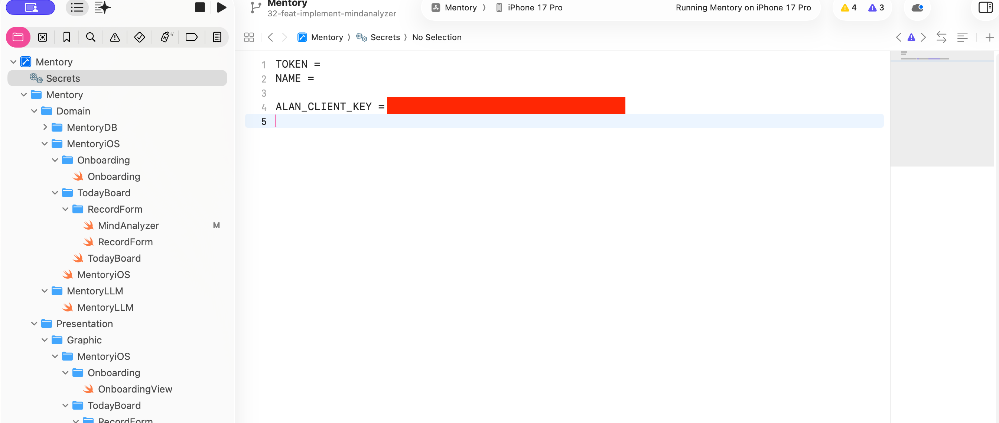
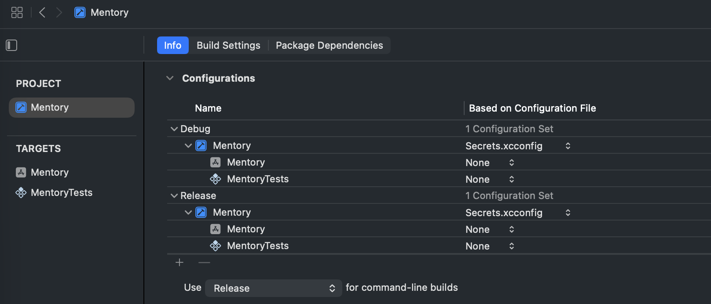
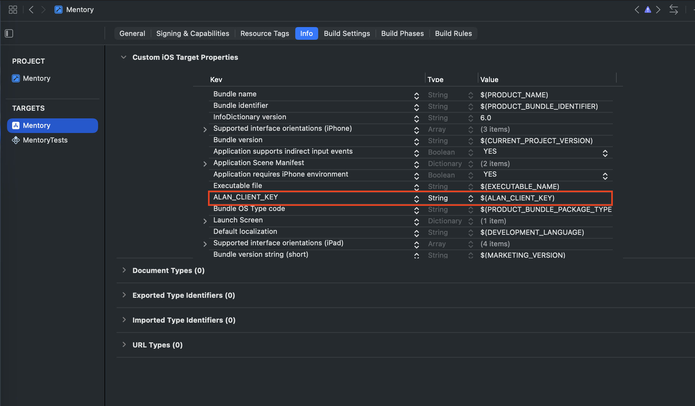

# xcconfig를 활용한 APIKey 관리

## 목차

- [xcconfig를 활용한 APIKey 관리](#xcconfig를-활용한-apikey-관리)
  - [목차](#목차)
  - [배경](#배경)
  - [설정 절차](#설정-절차)
    - [1. 템플릿과 개인 파일 분리](#1-템플릿과-개인-파일-분리)
    - [2. Base Configuration에 Secrets 연결](#2-base-configuration에-secrets-연결)
    - [3. Info.plist로 빌드 설정 전달](#3-infoplist로-빌드-설정-전달)
    - [4. 런타임에서 안전하게 읽기](#4-런타임에서-안전하게-읽기)
    - [5. CI/CD 및 동료와 값 공유](#5-cicd-및-동료와-값-공유)
  - [참고 자료](#참고-자료)
    - [1. Secrets.xcconfig 파일](#1-secretsxcconfig-파일)
    - [2. Build Info 탭 구성](#2-build-info-탭-구성)
    - [3. Info.plist 파일 값 연결](#3-infoplist-파일-값-연결)
  - [자주 발생하는 문제](#자주-발생하는-문제)

## 배경

Alan LLM을 호출할 때 발급받은 API Key를 `Secrets.xcconfig`에 저장하면 Git에는 노출되지 않으면서도 Xcode 빌드 설정으로 값을 전달할 수 있다.  
그러나 `xcconfig`를 프로젝트·타깃에 연결하지 않거나 Info.plist에 값을 노출하지 않으면 런타임에서 `Secrets.alanAPIKey`가 항상 빈 문자열을 반환하는 문제가 발생한다. 아래 절차는 키가 정상적으로 로딩되도록 보장하기 위한 최소 설정이다.

## 설정 절차

### 1. 템플릿과 개인 파일 분리

1. `Config/Secrets.xcconfig.example`(커밋 대상)에 기본 키 이름을 선언한다.
   ```xcconfig
   ALAN_API_KEY = __REPLACE_ME__
   ```
2. `cp Config/Secrets.xcconfig.example Config/Secrets.xcconfig` 실행 후 개인 API Key를 입력한다.
   ```xcconfig
   ALAN_API_KEY = "sk-live-xxxx"
   ```
3. 팀원이 키를 입력할 수 있도록 템플릿 사용법을 README나 Slack에 공유한다.

### 2. Base Configuration에 Secrets 연결

1. Xcode의 `Project ▸ Info ▸ Configurations`에서 Debug/Release의 `Base Configuration`에 `Config/Secrets.xcconfig`를 지정한다.
2. 이미 다른 `.xcconfig`를 사용 중이라면 파일 상단에 `#include "Config/Secrets.xcconfig"`를 추가한다.
3. 변경 후 `xcodebuild -showBuildSettings -workspace Mentory.xcworkspace -scheme Mentory | rg ALAN_API_KEY`를 실행하면 키가 빌드 설정에 노출되는 것을 확인할 수 있다(값은 마스킹된다).

### 3. Info.plist로 빌드 설정 전달

`xcconfig` 값은 빌드 설정 범위에만 존재하므로 런타임에서 읽으려면 Info.plist 등의 리소스로 흘려보내야 한다.

1. `Mentory/Supporting Files/Info.plist`에 `ALAN_API_KEY` 항목을 추가하고 **Value**를 `$(ALAN_API_KEY)`로 설정한다.
2. 빌드 시 Info.plist가 실존 값으로 치환되며, Swift에서는 일반 Info Dictionary 조회 방식으로 접근할 수 있다.

### 4. 런타임에서 안전하게 읽기

`Secrets.swift`(혹은 원하는 위치)에 아래와 같은 헬퍼를 둔다.

```swift
enum Secrets {
    static var alanAPIKey: String {
        guard
            let key = Bundle.main.object(forInfoDictionaryKey: "ALAN_API_KEY") as? String,
            key.isEmpty == false,
            key != "__REPLACE_ME__"
        else {
            assertionFailure("ALAN_API_KEY is missing. Check Config/Secrets.xcconfig.")
            return ""
        }
        return key
    }
}
```

이제 `URLRequest`를 만들 때 `Secrets.alanAPIKey`를 사용하면 Alan API 호출 헤더가 자동으로 구성된다.

### 5. CI/CD 및 동료와 값 공유

- CI에서 `Config/ci.Secrets.xcconfig`를 생성하고 `xcodebuild -xcconfig Config/ci.Secrets.xcconfig ...` 형태로 주입하면 로컬과 동일한 경로로 값이 전달된다.
- 로컬 개발자는 `fastlane`이나 런 스크립트에서 `if [ ! -f Config/Secrets.xcconfig ]; then cp ...; fi` 검증을 추가해 빈 설정으로 빌드되는 일을 막는다.
- 민감한 값 공유는 1Password, Vault, Slack 하드코딩 대신 시크릿 관리 툴을 사용한다.

## 참고 자료

### 1. Secrets.xcconfig 파일

<p align="center">
  
</p>

### 2. Build Info 탭 구성

<p align="center">
  
</p>

### 3. Info.plist 파일 값 연결

<p align="center">
  
</p>

## 자주 발생하는 문제

| 증상                                                      | 원인                                                          | 해결                                                                     |
| --------------------------------------------------------- | ------------------------------------------------------------- | ------------------------------------------------------------------------ |
| `Secrets.alanAPIKey`가 빈 문자열                          | Info.plist에 `$(ALAN_API_KEY)`가 없거나 템플릿 값이 남아 있음 | Info.plist 항목을 추가하고 실제 값을 입력                                |
| 빌드 로그에 `Unable to open file Config/Secrets.xcconfig` | 파일 경로가 이동됐거나 팀원이 템플릿 복사를 하지 않음         | `cp Config/Secrets.xcconfig.example Config/Secrets.xcconfig`를 다시 실행 |
| CI에서만 Authorization 헤더가 비어 있음                   | CI 머신에 키를 주입하지 않음                                  | `ci.Secrets.xcconfig`를 생성하고 `xcodebuild -xcconfig` 플래그로 연결    |

위 표의 세 가지를 확인하면 `Secrets.xcconfig` 기반 API Key 주입 문제 대부분을 해결할 수 있다.
