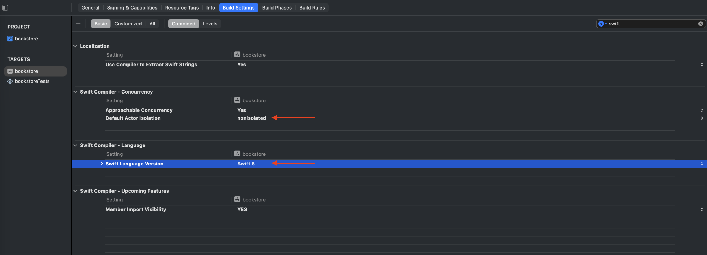

# MVVM에 Swift Concurrency 도입하기

## 목차

- [MVVM에 Swift Concurrency 도입하기](#mvvm에-swift-concurrency-도입하기)
  - [목차](#목차)
  - [개요](#개요)
    - [Swift Concurreny](#swift-concurreny)
  - [배경 지식](#배경-지식)
    - [세부 항목](#세부-항목)
    - [동시성 문제](#동시성-문제)
    - [Swift 6.2 - Approachable Concurrency](#swift-62---approachable-concurrency)
    - [Approachable Concurrency](#approachable-concurrency)
  - [참고 자료](#참고-자료)

## 개요

### Swift Concurreny

Swift Concurrency는 동시성을 활용해 작업을 비동기 처리하거나 연산을 병렬화고자 할 때, 이를 동기적인 방식으로 구현할 수 있도록 도와줍니다. Swift Concurrency에 포함된 기능 혹은 개념들입니다.

- 비동기 처리: `Task`, `async`, `await`, `withCheckedContinuation`
- 병렬 처리: `async let`, `TaskGroup`, `@concurrent`
- 공유 안정성: `Sendable`
- 원자성 보장: `Actor`, `nonisolated`
- 일관성 보장: `GlobalActor`, `MainActor`

## 배경 지식

### 세부 항목

1. Swift Concurrency와 코루틴, 동시성 구현 모델(Thread Pool, Continuation)
2. iOS GUI 이벤트 루프, RunLoop
3. 비즈니스 로직들로 구성된 하나의 작업(Flow)는 동시 실행(비동기 실행)될 수 있다.

### 동시성 문제

1. 객체의 갱신 충돌 - 10000번의 카운터

   ```swift
   // 동시성 문제 예시: 공유 데이터에 대한 경쟁 조건 (Race Condition)

   final class Counter {
       var value: Int = 0

       func increment() {
           let oldValue = value
           // 동시에 여러 Task가 접근할 경우, 중간 상태가 덮어씌워질 수 있음
           value = oldValue + 1
       }
   }

   let counter = Counter()

   await withTaskGroup(of: Void.self) { group in
       for _ in 0..<10_000 {
           group.addTask {
               counter.increment()
           }
       }
   }

   print("최종 카운트: \(counter.value)") // 예상: 10000, 실제: 더 작을 수 있음
   // 이 문제를 해결하려면 Actor 또는 Task-safe한 동시성 제어가 필요함
   ```

2. 객체들 간의 상태 일관성 - 은행 계좌

   ```swift
   // 동시성 문제 예시: 객체 간의 상태 불일치 (Inconsistent State)

   final class BankAccount {
       var balance: Int

       init(balance: Int) {
           self.balance = balance
       }

       func transfer(to target: BankAccount, amount: Int) {
           if balance >= amount {
               balance -= amount
               // 동시에 다른 스레드가 같은 계좌에서 송금하면, 중간 상태에서 불일치 발생 가능
               target.balance += amount
           }
       }
   }

   let accountA = BankAccount(balance: 1000)
   let accountB = BankAccount(balance: 1000)

   await withTaskGroup(of: Void.self) { group in
       for _ in 0..<1000 {
           group.addTask {
               accountA.transfer(to: accountB, amount: 1)
           }
       }
   }

   print("A 잔액: \(accountA.balance), B 잔액: \(accountB.balance), 합계: \(accountA.balance + accountB.balance)")
   // 예상: 합계 2000, 실제: 더 작을 수 있음
   // 이 문제를 해결하려면 Actor, Lock, 또는 Serial Queue로 일관성 있는 접근이 필요함
   ```

### Swift 6.2 - Approachable Concurrency

Swift 6.2의 Approachable Concurrency는 동시성을 더 쉽고 안전하게, 기존 코드베이스에서도 부담 없이 채택할 수 있도록 설계된 런타임 및 컴파일러 변화이다. 대부분의 코드가 기본적으로 메인 액터(MainActor) 혹은 호출자(actor)의 실행 컨텍스트에서 동작하도록 만들어 “언제 백그라운드로 떨어지는가?”에 대한 예측 가능성을 높인다.

- Swift의 주요 동시성 개념을 실무 코드에 자연스럽게 통합할 수 있게 하며, 기존 GCD나 completion handler 기반 코드와의 호환성을 개선한다.
- `@concurrent` 키워드를 통해 모호했던 `nonisolated async`의 의미를 명확하게 표현할 수 있다.
- MainActor의 암시적 채택 범위가 확대되어 UI 코드 외에도 기본 진입점(main run loop)에서 안전한 동작을 보장한다.

참고: [Swift 동시성 사용하기 - WWDC25 (Session 268)](https://developer.apple.com/kr/videos/play/wwdc2025/268)



### Approachable Concurrency

## 참고 자료

- [Apple: Meet async/await in Swift](https://developer.apple.com/videos/play/wwdc2021/10132/)
- [Apple: Swift Concurrency in Practice](https://developer.apple.com/videos/play/wwdc2022/110352/)
- [WWDC Sample: Bring structured concurrency to SwiftUI](https://developer.apple.com/documentation/swiftui/bringing-structured-concurrency-to-swiftui)
- [Apple: Embracing Swift Concurrency (WWDC25)](https://developer.apple.com/videos/play/wwdc2025/268/)
- [Apple: Code-along: Elevate an app with Swift concurrency (WWDC25)](https://developer.apple.com/videos/play/wwdc2025/270/)
- [Apple: Migrate your app to Swift 6 (WWDC24)](https://developer.apple.com/videos/play/wwdc2024/10169/)
- [Apple: What’s new in Swift (WWDC24)](https://developer.apple.com/videos/play/wwdc2024/10136/)
