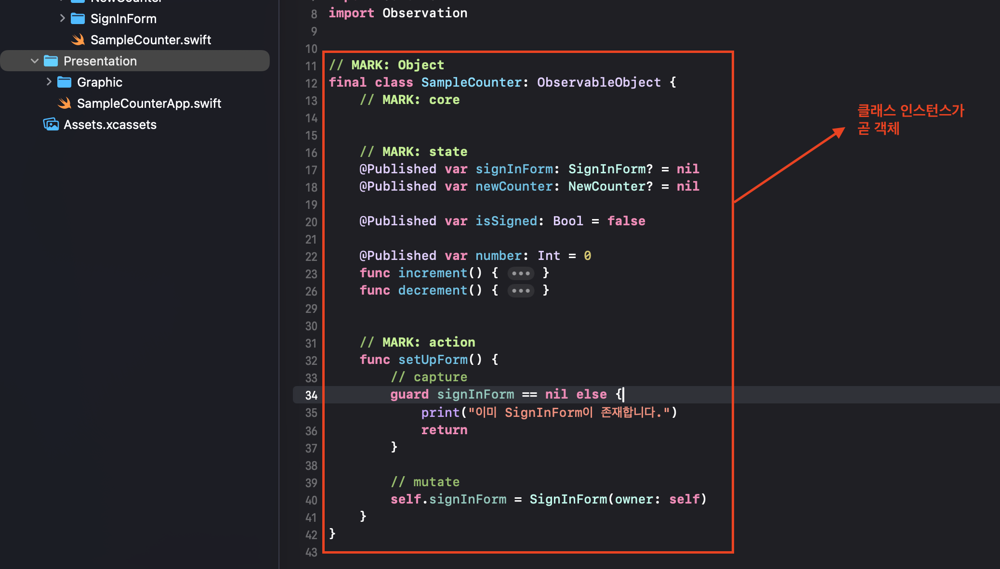

# SwiftUI에서 Combine 기반 MVVM 사용하기

## 목차

- [SwiftUI에서 Combine 기반 MVVM 사용하기](#swiftui에서-combine-기반-mvvm-사용하기)
  - [목차](#목차)
  - [개요](#개요)
    - [MVVM(Model-View-ViewModel) 이해](#mvvmmodel-view-viewmodel-이해)
    - [Domain과 Presentation](#domain과-presentation)
  - [활용](#활용)
    - [객체와 비즈니스 로직](#객체와-비즈니스-로직)
    - [게터, 세터, 액션](#게터-세터-액션)
    - [객체 템플릿](#객체-템플릿)
    - [OSLog를 활용한 로깅](#oslog를-활용한-로깅)
    - [객체의 트리 구조화](#객체의-트리-구조화)
    - [액션 검증하기](#액션-검증하기)
  - [참고 자료](#참고-자료)

## 개요

### MVVM(Model-View-ViewModel) 이해

**Mentory-iOS에서 사용한 아키텍처는 **MVVM**입니다.** MVVM의 핵심은 **View**가 직접 비즈니스 로직을 다루지 않고, **ViewModel**을 통해 상태를 표현하고 변경하도록 하는 것입니다. ViewModel은 사용자의 입력이나 외부 이벤트를 받아 **Model**의 상태를 갱신하고, 그 변화를 다시 View로 전달합니다.

Mentory-iOS에서는 Combine을 통해 이러한 데이터 흐름을 반응형으로 처리하여, 상태 변화가 발생하면 SwiftUI View가 자동으로 업데이트되도록 구성했습니다. 즉, MVVM은 Mentory의 모든 기능이 “데이터의 단방향 흐름(Flow)”을 중심으로 동작하도록 만드는 핵심 아키텍처라고 할 수 있습니다.

<p align="center">
  
</p>

### Domain과 Presentation

**프로젝트의 소스 코드는 Domain과 Presentation으로 구분됩니다.** 이때 Domain은 비즈니스 로직과 데이터 상태를 관리하는 핵심 영역으로, 앱의 기능적 규칙과 모델을 정의합니다. 반면 Presentation은 사용자 인터페이스와 상호작용을 담당하며, SwiftUI를 통해 ViewModel로부터 전달받은 상태 변화를 즉각적으로 반영합니다.

아래는 이를 확인할 수 있는 프로젝트의 파일 구조입니다. 애플리케이션의 상태와 관련된 모든 로직은 **Domain** 디렉토리 내에 정의되며, 여기서는 데이터 모델과 비즈니스 규칙, 그리고 상태 변화 로직이 관리됩니다. 반면 **Presentation** 디렉토리는 SwiftUI 기반의 사용자 인터페이스를 담당하며, ViewModel을 통해 전달된 상태 변화를 즉각적으로 반영하는 역할을 합니다.

```bash
# 프로젝트 폴더 구조
SampleCounter
├─ Domain            // 비즈니스 로직과 상태 객체
│  └─ SampleCounter  // 트리 형태고 구조화되는 객체들
└─ Presentation      // SwiftUI View와 App 진입점
   ├─ Graphic        // ContentView, SignInFormView 등 UI 조립
   └─ SampleCounterApp.swift
```

<p align="center">
  
</p>

## 활용

### 객체와 비즈니스 로직

Mentory-iOS에서 사용하는 아키텍처를 이해하고, 이를 기반으로 새로운 기능을 추가하려면 객체(Object) 개념을 이해해야 합니다. 주의할 점은 기존 객체 지향 프로그래밍 및 설계에서 말하는 객체와는 비슷하지만 약간 다른 개념을 가지고 있습니다.

본 프로젝트에서는 객체를 상태를 가진 데이터의 묶음으로 설명합니다. Mentory-iOS에서는 Domain에 속한 클래스들로 만들어진 인스턴스가 바로 이러한 객체에 해당합니다. 이러한 객체들은 소프트웨어의 실행부터 종료까지 메모리 상에 존재하게 되고, 비즈니스 로직을 이러한 객체의 상태를 변경하는 ~

<p align="center">
  
</p>

### 게터, 세터, 액션

객체의 상태와 관련된 비즈니스 로직은 다음 세 가지로 구분합니다.

<table>
  <thead>
    <tr>
      <th>구분</th>
      <th>목적</th>
      <th>범위</th>
      <th>예시</th>
    </tr>
  </thead>
  <tbody>
    <tr>
      <td><strong>게터 (Getter)</strong></td>
      <td>특정 상태를 조회</td>
      <td>한 상태</td>
      <td><code>getCount()</code></td>
    </tr>
    <tr>
      <td><strong>세터 (Setter)</strong></td>
      <td>특정 상태를 직접 변경</td>
      <td>한 상태</td>
      <td><code>setCount(_:)</code></td>
    </tr>
    <tr>
      <td><strong>액션 (Action)</strong></td>
      <td>여러 상태를 함께 읽고/변경하거나 외부 이벤트 흐름과 결합</td>
      <td>여러 상태</td>
      <td><code>incrementIfSignedIn()</code>, <code>resetAll()</code></td>
    </tr>
  </tbody>
</table>

아래는 간단한 카운터 예제입니다. 액션은 단일 상태 변경 이상을 수행하여 “규칙”을 코드로 보존합니다.

```swift
@MainActor
final class SomeCounter {
    // MARK: core

    // MARK: state
    private var count: Int = 0
    private var isSignedIn: Bool = false

    // 게터
    func getCount() -> Int { count }
    func getSignedIn() -> Bool { isSignedIn }

    // 세터
    func setCount(_ newValue: Int) {
        count = newValue
    }

    func setSignedIn(_ flag: Bool) {
        isSignedIn = flag
    }

    // MARK: action
    func incrementIfSignedIn() {
        guard isSignedIn else { return }
        count += 1
    }

    /// 로그인 상태를 해제하면서 카운트도 함께 초기화하는 규칙
    func signOutAndReset() {
        isSignedIn = false
        count = 0
    }

    /// 특정 조건(예: 음수 방지)을 보장하는 복합 변경
    func decrementSafely() {
        guard count > 0 else { return }
        count -= 1
    }
}
```

### 객체 템플릿

아래는 MentoryiOS에서 사용하는 객체의 템플릿입니다.

```swift
import Foundation
import Combine

// MARK: Object
@MainActor
final class SampleObject: Sendable, ObservableObject {
// MARK: core

    // MARK: state


    // MARK: action


    // MARK: value
    nonisolated struct ObjectValue: Sendable, Hashable {
        let rawValue: String
    }
}

```

### OSLog를 활용한 로깅

Mentory-iOS에서는 액션의 흐름과 상태 변화를 추적하기 위해 [`OSLog`](https://developer.apple.com/documentation/os/oslog)를 활용합니다. OSLog는 시스템 전반에서 일관된 로그 포맷과 필터링 도구(Console.app, Instruments 등)를 제공하므로, 액션 실행 순서나 Combine 스트림에서 발생하는 이벤트를 분석할 때 유용합니다.

- 뷰모델이나 객체에서 `Logger(subsystem:category:)`를 한 번만 선언하고 재사용합니다.
- 액션 단위로 `info`/`debug`/`error` 레벨을 구분해 상태 변화를 기록합니다.
- 민감한 값은 `.privacy(.private)`를 명시해 Console 출력 시 자동으로 마스킹되도록 합니다.

```swift
import OSLog

@MainActor
final class SomeCounter {
    private let logger = Logger(subsystem: "com.mentory.samplecounter",
                                category: "SomeCounter")

    func incrementIfSignedIn() {
        guard isSignedIn else {
            logger.debug("increment skipped – not signed in")
            return
        }
        let oldValue = count
        count += 1
        logger.info("incremented from \(oldValue) to \(self.count, privacy: .public)")
    }

    func signOutAndReset() {
        logger.notice("signing out and resetting counter")
        isSignedIn = false
        count = 0
    }
}
```

> [!TIP]
> Combine 파이프라인에서도 `handleEvents(receiveOutput:)` 안에서 logger를 호출하면, 토픽 별로 추적 가능한 “이벤트 타임라인”을 남길 수 있습니다.

### 객체의 트리 구조화

일반적으로 소프트웨어의 내부에서는 객체들이 트리(Tree) 형태로 구조화되는 경우가 많습니다. 이는 상위 객체가 하위 객체를 소유하고, 하위 객체가 다시 더 작은 단위의 객체를 포함하는 계층적 구조를 뜻합니다. Mentory-iOS의 경우 `SampleCounter`가 루트 객체로 존재하며, 그 내부에 `SignInForm`, `NewCounter` 같은 하위 객체들이 존재합니다.

이러한 구조를 선택한 이유는 현실 세계의 객체 탐색 방식을 소프트웨어적으로 구현하기 위함입니다. 사용자는 앱을 사용할 때 “로그인 화면 → 감정 기록 → 통계 보기”와 같이 상위 개념에서 하위 개념으로 탐색합니다. Mentory-iOS는 이 사용자 경험을 그대로 반영해, 내부 객체 구조 또한 동일한 탐색 경로를 가지도록 설계했습니다. 즉, 객체의 트리 구조는 사용자의 실제 사고 흐름과 UI 흐름을 코드 레벨에서 일치시키는 역할을 합니다

> [!NOTE]
> 물론, 객체들이 반드시 트리 형태로 구조화될 필요는 없습니다. 다만 이러한 객체의 계층적 트리 구조가 가장 사용자에게 직관적입니다.

### 액션 검증하기

이러한 아키텍처를 사용할 때 테스트 케이스는 **사용자의 액션에 따라 상태가 올바르게 변하는지 검증하는 과정**이라고 할 수 있습니다. 게터와 세터를 검증하기도 하지만, 액션의 내부에서 게터와 세터가 호출되어 간접적으로 검증할 수 있으므로 따로 검증할 필요는 없습니다.

```swift
import Testing
@testable import Mentory

@Test
func testSomeCounterBehavior() async throws {
    // given
    let counter = SomeCounter()

    try await #require(counter.getCount() == 0)
    try await #require(counter.getSignedIn() == false)

    // when
    counter.incrementIfSignedIn()   // 로그인 상태에서 카운트 증가
    counter.signOutAndReset()       // 로그아웃 시 카운트 초기화
    counter.decrementSafely()       // 음수 방지 로직 확인

    // THEN: 상태가 의도된 대로 유지되는지 검증
    #expect(counter.getSignedIn() == false, "로그아웃 후에는 비로그인 상태여야 합니다.")
    #expect(counter.getCount() == 0, "로그아웃 및 리셋 이후 카운트는 0이어야 합니다.")
}
```

## 참고 자료

- [Apple: Introducing Combine](https://developer.apple.com/videos/play/wwdc2019/722/)
- [Apple: Data Essentials in SwiftUI](https://developer.apple.com/videos/play/wwdc2020/10040/)
- [Apple: Data Flow Through SwiftUI (WWDC21)](https://developer.apple.com/videos/play/wwdc2021/10019/)
- [Apple: Combine in Practice](https://developer.apple.com/videos/play/wwdc2020/10147/)
